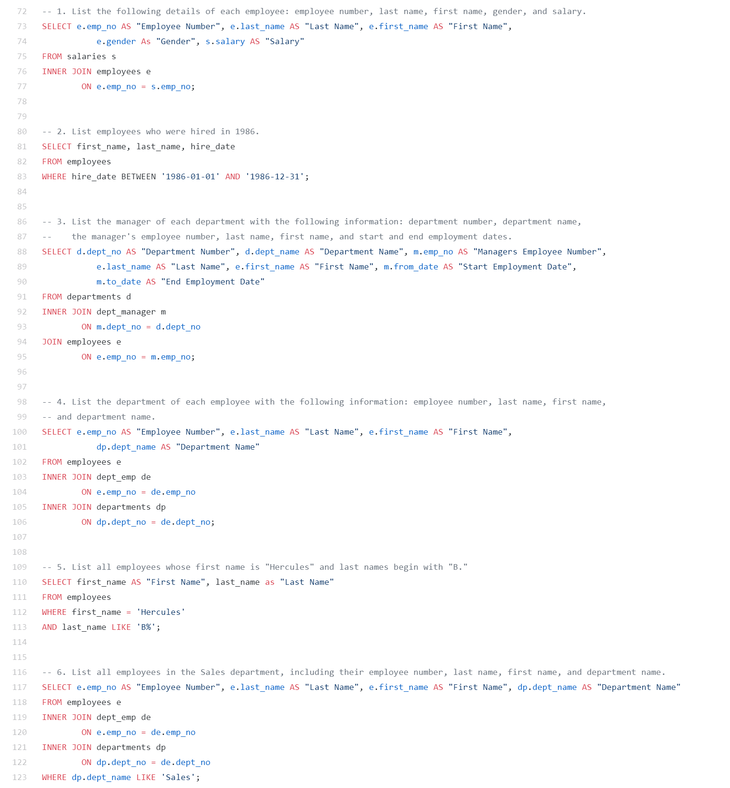

# Creation of a Database

## About
<br>

In this exercise I will be performing:

* Data Modeling (Design the tables to hold data in the CSVs).

* Data Engineering (Import the CSVs into a SQL database).

* Data Analysis (Answer questions about the data).

<br>

Technology Used:

* MySQL
* Python: Pandas, SQLAlchemy


## Process

<br>

* Data Modeling: Inspected the CSVs and sketch out an ERD of the tables.

<br>


<br><br>

* Data Engineering: Created table schema for each of the six CSV files. For each table schema was specified: data types, primary keys, foreign keys, and other constraints.

--> Imported each CSV file into the corresponding SQL table.

<br>


<br>

* Data Analysis: Queries <br>

<br>




## Visualization of the data

Imported the SQL database into Jupyter Notebook using:

```text
from sqlalchemy import create_engine

engine = create_engine('postgresql://localhost:5432/<your_db_name>')

connection = engine.connect()
```
<br>

* Histogram to visualize the most common salary ranges for employees:

<br>


<br>

* Bar chart of average salary by title:

<br>


<br><br>
